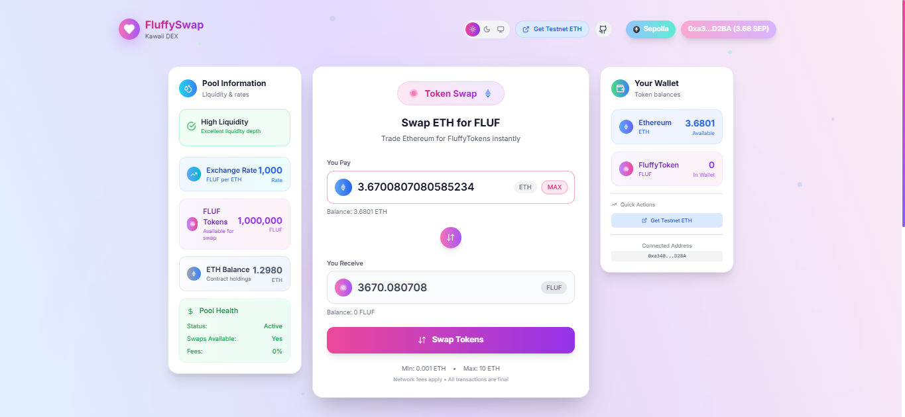

# 🌸 FluffySwap - Professional Kawaii Decentralized Exchange

<div align="center">
  
  
  [](https://opensource.org/licenses/MIT)
  [](https://www.typescriptlang.org/)
  [](https://reactjs.org/)
  [](https://ethereum.org/)
  [](https://hardhat.org/)
</div>

A production-ready, kawaii-themed decentralized exchange (DEX) built for Ethereum Sepolia testnet. Swap ETH for FLUF tokens with adorable animations, secure smart contracts, and delightful user experience.

## ✨ Features

### 🎨 Frontend Excellence
- **Modern React 18** with TypeScript for type safety
- **Kawaii Design System** with pastel colors and smooth animations
- **Responsive UI** optimized for mobile, tablet, and desktop
- **Dark/Light Theme** with system preference detection
- **Wallet Integration** via RainbowKit (MetaMask, WalletConnect, etc.)
- **Real-time Updates** with automatic balance refresh
- **Error Boundaries** for graceful error handling
- **Accessibility** WCAG 2.1 AA compliant

### 🔐 Smart Contract Security
- **OpenZeppelin Standards** for battle-tested security
- **ReentrancyGuard** protection against reentrancy attacks
- **Access Control** with owner-only administrative functions
- **Input Validation** comprehensive parameter checking
- **Event Logging** for transparency and debugging
- **Gas Optimization** efficient storage patterns

### 🛠️ Developer Experience
- **Full TypeScript** end-to-end type safety
- **Comprehensive Testing** unit tests for all functions
- **Auto-deployment** scripts with contract verification
- **Hot Reload** instant development feedback
- **ESLint & Prettier** code quality enforcement
- **Modular Architecture** clean separation of concerns

## 🚀 Quick Start

### Prerequisites

Ensure you have the following installed:
- **Node.js** 18+ and npm
- **Git** for version control
- **MetaMask** or compatible Web3 wallet
- **Sepolia testnet ETH** ([Get from faucet](https://sepoliafaucet.com/))

### Installation

```bash
# Clone the repository
git clone https://github.com/HuzaifaKhanDeveloper/fluffyswap.git
cd fluffyswap

# Install dependencies
npm install

# Copy environment template
cp .env.example .env
```

### Environment Configuration

Create a `.env` file in the root directory:

```env
# Required for frontend
VITE_INFURA_API_KEY=your_infura_api_key_here
VITE_WALLETCONNECT_PROJECT_ID=your_walletconnect_project_id_here

# Optional: Custom contract addresses (uses defaults if not set)
VITE_MY_TOKEN_ADDRESS=0x02a9fc62de4a523c16a0f056a1db92b3cef10a58
VITE_FLUFFY_SWAP_ADDRESS=0xcf9857622dc4bdf71b1cdbbc7d3ad9215027afc6

# Required for deployment and testing
PRIVATE_KEY=your_private_key_here
SEPOLIA_RPC_URL=https://sepolia.infura.io/v3/YOUR_INFURA_KEY
ETHERSCAN_API_KEY=your_etherscan_api_key_here
```

### Development Workflow

```bash
# Start local blockchain (optional)
npm run node

# Compile smart contracts
npm run compile

# Run comprehensive tests
npm run test

# Deploy contracts to Sepolia
npm run deploy

# Start frontend development server
npm run dev
```

## 📋 Project Structure

```
fluffyswap/
├── contracts/                 # Smart contracts
│   ├── FluffySwap.sol        # Main DEX contract
│   └── MyToken.sol           # ERC-20 FLUF token
├── scripts/                  # Deployment scripts
│   └── deploy.ts             # Contract deployment
├── test/                     # Contract tests
├── src/                      # Frontend source
│   ├── components/           # React components
│   │   ├── SwapInterface.tsx # Main swap UI
│   │   ├── WalletConnect.tsx # Wallet connection
│   │   ├── PoolInfo.tsx      # Liquidity information
│   │   └── ...               # Other components
│   ├── config/               # Configuration
│   │   ├── contracts.ts      # Contract addresses & ABIs
│   │   └── wagmi.ts          # Web3 configuration
│   ├── hooks/                # Custom React hooks
│   │   └── useTheme.ts       # Theme management
│   └── styles/               # Styling
├── public/                   # Static assets
├── hardhat.config.ts         # Hardhat configuration
├── package.json              # Dependencies
└── README.md                 # This file
```

## 🔧 Smart Contract Architecture

### MyToken.sol (FLUF Token)
```solidity
// ERC-20 token with additional features
- Standard ERC-20 functionality
- Minting capability (owner only)
- Burning functionality (user initiated)
- 18 decimal precision
- 1M initial supply
- Comprehensive event logging
```

### FluffySwap.sol (DEX Contract)
```solidity
// Secure decentralized exchange
- ETH to FLUF token swaps
- Configurable exchange rates
- Minimum/maximum swap limits
- Emergency withdrawal functions
- Reentrancy protection
- Owner access controls
```

## 🧪 Testing

Run the comprehensive test suite:

```bash
# Run all tests with coverage
npm run test

# Run tests with gas reporting
REPORT_GAS=true npm run test

# Run specific test file
npx hardhat test test/FluffySwap.test.ts

# Generate coverage report
npm run coverage
```

### Test Coverage Areas
- ✅ Contract deployment and initialization
- ✅ Token minting and burning
- ✅ Swap functionality and validation
- ✅ Rate management and updates
- ✅ Withdrawal mechanisms
- ✅ Access control verification
- ✅ Error handling and edge cases
- ✅ Event emission verification

## 🌐 Deployment Guide

### Sepolia Testnet Deployment

1. **Prepare Environment**
   ```bash
   # Ensure you have Sepolia ETH
   # Set up your .env file with required keys
   ```

2. **Deploy Contracts**
   ```bash
   npm run deploy
   ```

3. **Verify Contracts**
   ```bash
   npx hardhat verify --network sepolia <CONTRACT_ADDRESS> <CONSTRUCTOR_ARGS>
   ```

### Deployment Process
The deployment script automatically:
1. Deploys MyToken (FLUF) with initial supply
2. Deploys FluffySwap with initial exchange rate
3. Transfers initial liquidity to the DEX
4. Updates frontend configuration
5. Saves deployment information

### Production Checklist
- [ ] Smart contracts audited and tested
- [ ] Environment variables configured
- [ ] Testnet deployment successful
- [ ] Frontend error boundaries tested
- [ ] Mobile responsiveness verified
- [ ] Accessibility compliance checked
- [ ] Performance optimization completed

## 🎨 Design System

### Color Palette
```css
/* Kawaii Theme Colors */
--pink-pastel: #FFD1DC     /* Primary pink */
--mint-green: #B5EAD7      /* Secondary mint */
--lavender: #C7CEEA        /* Accent lavender */
--soft-pink: #F8BBD9       /* Soft pink */
--light-purple: #E4C1F9    /* Light purple */

/* Semantic Colors */
--success: #10B981         /* Success green */
--warning: #F59E0B         /* Warning amber */
--error: #EF4444           /* Error red */
--info: #3B82F6            /* Info blue */
```

### Typography Scale
```css
/* Font Weights */
--font-regular: 400
--font-medium: 500
--font-semibold: 600
--font-bold: 700

/* Line Heights */
--leading-tight: 120%      /* Headings */
--leading-normal: 150%     /* Body text */
--leading-relaxed: 175%    /* Large text */
```

### Spacing System
```css
/* 8px base unit system */
--space-1: 0.25rem  /* 4px */
--space-2: 0.5rem   /* 8px */
--space-3: 0.75rem  /* 12px */
--space-4: 1rem     /* 16px */
--space-6: 1.5rem   /* 24px */
--space-8: 2rem     /* 32px */
--space-12: 3rem    /* 48px */
--space-16: 4rem    /* 64px */
```

## 🔌 API Reference

### Contract Interfaces

#### FluffySwap Contract
```typescript
interface FluffySwapContract {
  // View functions
  tokensPerEth(): Promise<bigint>
  getTokenBalance(): Promise<bigint>
  getEthBalance(): Promise<bigint>
  calculateTokenAmount(ethAmount: bigint): Promise<bigint>
  
  // State-changing functions
  swapEthForTokens(): Promise<TransactionResponse>
  updateRate(newRate: bigint): Promise<TransactionResponse>
  withdrawEth(amount: bigint): Promise<TransactionResponse>
  withdrawTokens(amount: bigint): Promise<TransactionResponse>
}
```

#### MyToken Contract
```typescript
interface MyTokenContract {
  // ERC-20 standard
  balanceOf(account: string): Promise<bigint>
  transfer(to: string, amount: bigint): Promise<boolean>
  approve(spender: string, amount: bigint): Promise<boolean>
  
  // Extended functionality
  mint(to: string, amount: bigint): Promise<TransactionResponse>
  burn(amount: bigint): Promise<TransactionResponse>
}
```

### Frontend Hooks

#### useSwap Hook
```typescript
const {
  swapTokens,
  isLoading,
  error,
  txHash
} = useSwap({
  ethAmount: string,
  onSuccess?: () => void,
  onError?: (error: Error) => void
})
```

#### useBalance Hook
```typescript
const {
  ethBalance,
  flufBalance,
  isLoading,
  refetch
} = useBalance(address?: string)
```

## 🚨 Error Handling

### Smart Contract Errors
```solidity
// Custom errors for gas efficiency
error InsufficientETH();
error InsufficientTokenLiquidity();
error InvalidRate();
error TransferFailed();
error Unauthorized();
```

### Frontend Error Types
```typescript
enum ErrorType {
  WALLET_NOT_CONNECTED = 'WALLET_NOT_CONNECTED',
  INSUFFICIENT_BALANCE = 'INSUFFICIENT_BALANCE',
  TRANSACTION_REJECTED = 'TRANSACTION_REJECTED',
  NETWORK_ERROR = 'NETWORK_ERROR',
  CONTRACT_ERROR = 'CONTRACT_ERROR'
}
```

### Error Recovery Strategies
- **Automatic Retry** for network failures
- **User Guidance** for wallet issues
- **Fallback UI** for contract errors
- **Graceful Degradation** for feature failures

## 🔒 Security Considerations

### Smart Contract Security
- **Reentrancy Protection** via OpenZeppelin's ReentrancyGuard
- **Access Control** owner-only administrative functions
- **Input Validation** comprehensive parameter checking
- **Integer Overflow** protection via Solidity 0.8+
- **External Call Safety** proper error handling

### Frontend Security
- **Environment Variables** sensitive data protection
- **Input Sanitization** user input validation
- **XSS Prevention** proper data encoding
- **CSRF Protection** via SameSite cookies
- **Content Security Policy** XSS mitigation

### Operational Security
- **Private Key Management** never commit private keys
- **API Key Rotation** regular key updates
- **Audit Logging** comprehensive event tracking
- **Incident Response** documented procedures

## 📊 Performance Optimization

### Frontend Performance
- **Code Splitting** lazy loading of components
- **Bundle Optimization** tree shaking and minification
- **Image Optimization** WebP format and lazy loading
- **Caching Strategy** service worker implementation
- **Memory Management** proper cleanup of subscriptions

### Smart Contract Gas Optimization
- **Storage Optimization** packed structs and minimal storage
- **Function Optimization** view functions where possible
- **Event Optimization** indexed parameters for filtering
- **Batch Operations** multiple operations in single transaction

## 🤝 Contributing

We welcome contributions! Please follow these guidelines:

### Development Process
1. **Fork** the repository
2. **Create** a feature branch (`git checkout -b feature/amazing-feature`)
3. **Commit** your changes (`git commit -m 'Add amazing feature'`)
4. **Push** to the branch (`git push origin feature/amazing-feature`)
5. **Open** a Pull Request

### Code Standards
- **TypeScript** for all new code
- **ESLint** configuration compliance
- **Prettier** for code formatting
- **Conventional Commits** for commit messages
- **Test Coverage** maintain >90% coverage

### Pull Request Checklist
- [ ] Code follows project style guidelines
- [ ] Self-review completed
- [ ] Tests added for new functionality
- [ ] Documentation updated
- [ ] No breaking changes (or clearly documented)

## 🐛 Troubleshooting

### Common Issues

#### "Transaction failed" errors
**Symptoms:** Swap transactions fail with generic error
**Solutions:**
- Check ETH balance for gas fees
- Verify swap amount is within limits (0.001 - 10 ETH)
- Ensure sufficient DEX liquidity
- Try increasing gas limit

#### Wallet connection issues
**Symptoms:** Cannot connect wallet or frequent disconnections
**Solutions:**
- Clear browser cache and cookies
- Try different wallet or browser
- Ensure network is set to Sepolia testnet
- Disable conflicting browser extensions

#### Contract interaction failures
**Symptoms:** Read/write operations fail
**Solutions:**
- Verify contract addresses in configuration
- Check if contracts are deployed and verified
- Ensure proper network connection
- Validate ABI compatibility

#### Performance issues
**Symptoms:** Slow loading or laggy animations
**Solutions:**
- Disable animations in system preferences
- Clear browser cache
- Check network connection
- Update browser to latest version

### Debug Mode
Enable debug mode for detailed logging:
```bash
# Development
VITE_DEBUG=true npm run dev

# Production debugging
localStorage.setItem('debug', 'fluffyswap:*')
```

### Support Channels
- 📧 **Email:** support@fluffyswap.dev
- 💬 **Discord:** [FluffySwap Community](https://discord.gg/fluffyswap)
- 🐦 **Twitter:** [@FluffySwapDEX](https://twitter.com/fluffyswapdex)
- 🐛 **Issues:** [GitHub Issues](https://github.com/HuzaifaKhanDeveloper/fluffyswap/issues)

## 📄 License

This project is licensed under the MIT License - see the [LICENSE](LICENSE) file for details.

## 🙏 Acknowledgments

### Core Technologies
- **[OpenZeppelin](https://openzeppelin.com/)** - Secure smart contract libraries
- **[RainbowKit](https://www.rainbowkit.com/)** - Beautiful wallet connection UI
- **[Wagmi](https://wagmi.sh/)** - React hooks for Ethereum
- **[Framer Motion](https://www.framer.com/motion/)** - Smooth animations
- **[Tailwind CSS](https://tailwindcss.com/)** - Utility-first styling
- **[Hardhat](https://hardhat.org/)** - Ethereum development environment
- **[Vite](https://vitejs.dev/)** - Fast build tool

### Design Inspiration
- **Apple Design System** - Clean, intuitive interfaces
- **Kawaii Culture** - Cute, friendly aesthetics
- **Material Design** - Consistent interaction patterns
- **Fluent Design** - Smooth, natural animations

### Community
- **Ethereum Foundation** - Blockchain infrastructure
- **DeFi Community** - Decentralized finance innovation
- **Open Source Contributors** - Collaborative development
- **Beta Testers** - Quality assurance and feedback

---

<div align="center">
  <p>Made with 💖 for the kawaii DeFi community</p>
  <p>
    <a href="https://fluffyswap.dev">🌐 Website</a> •
    <a href="https://docs.fluffyswap.dev">📚 Documentation</a> •
    <a href="https://github.com/HuzaifaKhanDeveloper/fluffyswap/issues">🐛 Report Bug</a> •
    <a href="https://github.com/HuzaifaKhanDeveloper/fluffyswap/discussions">💬 Discussions</a>
  </p>
  
  <p>
    
    
    
  </p>
</div>